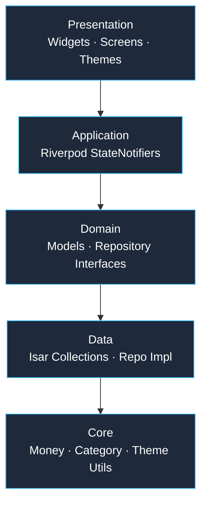
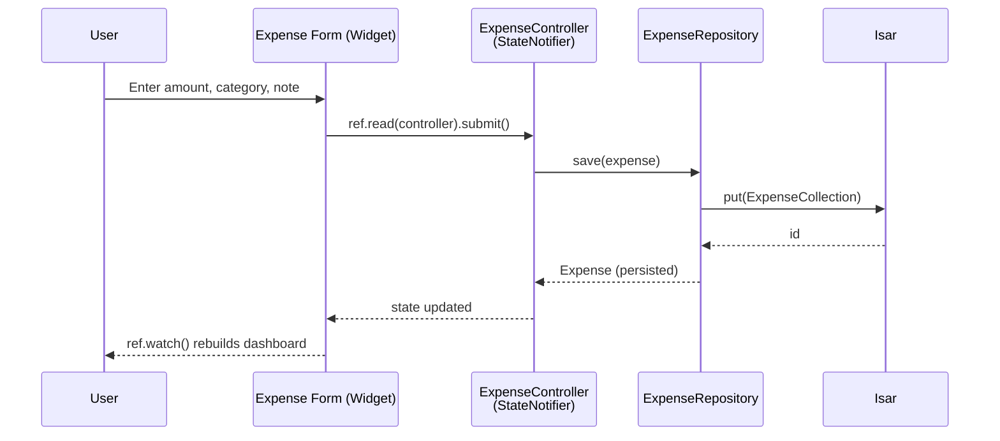

# ClearSpend — Personal Finance Manager

[](https://flutter.dev)
[](https://dart.dev)
[](LICENSE)
[](https://flutter.dev)

**ClearSpend** is an offline-first personal finance manager built with Flutter. Track expenses, manage budgets, monitor investments, and hit savings goals — all without a single byte leaving the device.

---

## Table of Contents

- [Features](#features)
- [Architecture](#architecture)
- [Data Flow](#data-flow)
- [Tech Stack](#tech-stack)
- [Getting Started](#getting-started)
- [Project Structure](#project-structure)
- [Modules](#modules)
- [Security](#security)
- [Backup & Restore](#backup--restore)
- [Contributing](#contributing)
- [License](#license)

---

## Features

### 💰 Expense Tracking
- Categories, notes, dates, quick-entry presets
- UPI QR code scanning — parses UPI URIs, auto-suggests category
- Recurring transactions with schedule
- Split expenses across categories
- Receipt image attachment

### 📊 Analytics & Insights
- Monthly spending breakdown, pie/bar charts
- Spending streak tracking
- Daily average and month-end projections

### 🎯 Budgeting
- Per-category monthly budgets with progress bars
- Color-coded alerts: green `<70%`, yellow `70–90%`, red `>90%`
- Over-budget warning banner, budget vs actual chart

### 🏆 Savings Goals
- Target amount + deadline, circular progress indicators
- Auto-calculated monthly contribution needed

### 📈 Investment Portfolio
- 10 asset types: Stocks, Mutual Funds, SIP, Gold, FD, PPF, NPS, Crypto, Bonds
- Real-time P&L, XIRR calculation
- SIP/NAV history, maturity countdowns, asset allocation chart

### 📒 Khata (Lending & Borrowing)
- Contact picker, due-date reminders, per-person ledger

### 💼 Trading P&L
- Equity/futures/options/crypto trade log
- Win rate, average P&L, monthly chart, trade frequency heatmap

### 🏦 EMIs & Loans
- Progress tracking, due dates, remaining balance

### 🔐 Security
- Biometric app lock, PIN/pattern fallback, auto-lock on background
- 100% local storage — zero cloud dependency

### 🌐 Multi-Currency
- INR, USD, EUR, GBP, JPY, CNY, AED, SAR with live preview

---

## Architecture

ClearSpend follows a strict **layered architecture** — dependencies only point downward.



- **Domain** — pure Dart, zero Flutter/Isar imports. Models + interfaces only.
- **Application** — all business logic lives in Riverpod `StateNotifier` controllers.
- **Data** — implements domain repository interfaces with Isar persistence.
- **Presentation** — Flutter widgets that only ever talk to providers.
- **Core** — shared utilities: Money formatting, Category enum, theming.

---

## Data Flow

Example: adding an expense end-to-end.



All mutations flow through a `StateNotifier`; the UI never touches Isar directly. Data lands in **Isar** (expenses, EMIs, trades, investments) or **Hive** (settings, budgets, goals).

---

## Tech Stack

| Category | Technology |
|---|---|
| **Framework** | [Flutter](https://flutter.dev) 3.19+ |
| **Language** | [Dart](https://dart.dev) 3.3+ |
| **State Management** | [Riverpod](https://riverpod.dev) 2.x |
| **Local Database** | [Isar](https://isar.dev) 3.x (primary), [Hive](https://docs.hivedb.dev) 2.x (settings) |
| **Charts** | [fl_chart](https://flchart.dev) |
| **Scanner** | [mobile_scanner](https://pub.dev/packages/mobile_scanner) |
| **Auth** | [local_auth](https://pub.dev/packages/local_auth) |
| **File Picker** | [file_picker](https://pub.dev/packages/file_picker) |
| **Image** | [image_picker](https://pub.dev/packages/image_picker) |
| **Contacts** | [flutter_contacts](https://pub.dev/packages/flutter_contacts) |
| **Sharing** | [share_plus](https://pub.dev/packages/share_plus) |
| **CSV** | [csv](https://pub.dev/packages/csv) |
| **Fonts** | [Google Fonts](https://pub.dev/packages/google_fonts) |
| **Permissions** | [permission_handler](https://pub.dev/packages/permission_handler) |

---

## Getting Started

### Prerequisites
- [Flutter SDK](https://flutter.dev/docs/get-started/install) 3.19.0+
- Dart SDK 3.3.0+
- VS Code, Android Studio, or IntelliJ

### Installation

```bash
git clone https://github.com/Ashok-461999/clearSpend.git
cd clearSpend
flutter pub get
dart run build_runner build --delete-conflicting-outputs
```

### Running the App

```bash
flutter run                # connected device
flutter run -d chrome       # Web
flutter run -d windows      # Windows desktop
flutter run -d macos        # macOS

flutter build apk --release # Release APK
flutter build ios --release # iOS release
```

---

## Project Structure

```
lib/
├── app.dart
├── main.dart
├── application/
│   ├── budget/
│   ├── coins/
│   ├── emi/
│   ├── expense/
│   ├── history/
│   ├── investment/
│   ├── khata/
│   ├── settings/
│   └── trade/
├── core/
│   ├── category.dart
│   ├── category_suggestions.dart
│   ├── date_range.dart
│   ├── investment_calculator.dart
│   ├── money.dart
│   ├── theme.dart
│   └── upi_parser.dart
├── data/
│   ├── repositories/
│   └── sources/
├── domain/
│   ├── models/
│   └── repositories/
└── presentation/
    ├── analysis/
    ├── budget/
    ├── dashboard/
    ├── emis/
    ├── expense/
    ├── history/
    ├── investment/
    ├── khata/
    ├── scanner/
    ├── settings/
    ├── shared/
    ├── shell/
    ├── trade/
    └── wallets/
```

---

## Modules

| Module | Summary |
|---|---|
| **Dashboard** | Month income/expense/balance, budget progress, khata summary, streaks, coin vault |
| **Expense Entry** | Quick Entry form + Scan & Add (UPI QR auto-fill) |
| **Budgets** | Per-category limits, live progress bars, budget vs actual chart |
| **Goals** | Target + deadline, circular progress, auto-computed monthly contribution |
| **Investments** | 10 asset types, XIRR, allocation chart, SIP/NAV history, maturity countdowns |
| **Trading Log** | Equity/futures/options/crypto, win rate, P&L distribution, heatmap |
| **Khata** | Lending/borrowing ledger, contact picker, due dates |
| **EMIs** | Progress, due dates, remaining balance |
| **Settings** | Theme, currency, biometric lock, notifications, backup/restore, data reset |

---

## Security

- **Biometric authentication** via `local_auth` (fingerprint / face)
- **PIN/Pattern fallback** — 6-digit PIN or 3×3 pattern, lockout after 5 failed attempts
- **Auto-lock** on app backgrounding
- **Security questions** for PIN recovery
- **Zero network calls** — no cloud sync, no external servers, ever

---

## Backup & Restore

**Export:** Settings → Data → Backup Data → pick save location → JSON export of everything (expenses, EMIs, khata, trades, budgets, goals, investments).

**Import:** Settings → Data → Restore Data → select backup file → confirm overwrite → current data replaced.

---

## Contributing

1. Fork the project
2. `git checkout -b feature/AmazingFeature`
3. `git commit -m 'Add some AmazingFeature'`
4. `git push origin feature/AmazingFeature`
5. Open a Pull Request

**Code style:**
- Follow the existing layered architecture
- Domain models must be pure Dart (no Flutter/Isar imports)
- Riverpod for all state management
- All monetary values stored as `int` (paise) — never `double`

---

## License

Distributed under the MIT License. See `LICENSE` for details.

---

<p align="center">
  Built with ❤️ using Flutter<br>
  <sub>ClearSpend — Your money, under your control.</sub>
</p>
